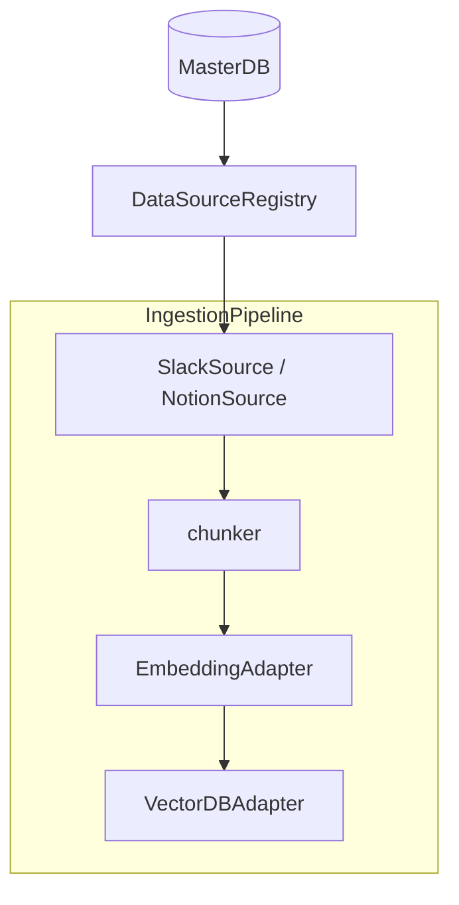

# Embeddings, Data Sources ve Ingestion Genişletmesi

## Ön koşul

Kod değişiklikleri için **Agent modu** gerekir (şu an plan/reddedilmiş modda `.py` dosyaları düzenlenemiyor).

## 1. VectorDB: genel filtre ile silme (pipeline için)

- [`app/vectordb/base.py`](app/vectordb/base.py): `delete_by_normalized_filter(collection_name, filters)` soyut metodu ekle; `delete_by_doc_id` içinde yalnızca `{"must":[{"field":"doc_id","value": doc_id}]}` ile bu metoda delege et (davranış korunur).
- [`app/vectordb/qdrant_adapter.py`](app/vectordb/qdrant_adapter.py): Mevcut scroll+`PointIdsList` silme döngüsünü `build_qdrant_filter(filters)` ile genelleştir.
- [`app/vectordb/pinecone_adapter.py`](app/vectordb/pinecone_adapter.py): `build_pinecone_filter` ile tekrarlayan `query` (top_k üst sınırı) + id toplama + `delete(ids=...)`; büyük kümeler için döngü (her turda silinen kadar tekrar) — tam garanti için dokümante sınır.

## 2. [`app/database.py`](app/database.py) — yeni tablolar ve metodlar

**Yeni tablolar** (mevcut `container_registry` / `health_check_log` dokunulmaz):

- `data_sources` — spesifikasyondaki sütunlar; `credentials_json` / `access_control_json` / `metadata_json` metin.
- `sync_log` — `log_id` PK, `source_id` FK benzeri (uygulama katmanında tutarlılık).
- `embedding_config` — tek satır `config_id='default'`.
- `ingestion_scheduler` — tek satır `id='default'`, `interval_minutes`, `updated_at` (PUT `/master/ingestion/scheduler` için).

**Yeni MasterDB metodları**: `get_source`, `list_sources`, `add_source`, `update_source`, `remove_source` (sync_log satırlarını da sil), `update_source_sync_state`, `log_sync_entry`, `get_sync_log`, `get_embedding_config`, `set_embedding_config`, `get_scheduler_interval`, `set_scheduler_interval`, `_row_to_source`, `_source_to_dict`.

**Kimlik şifreleme** (ayrı küçük modül önerisi [`app/sources/credential_crypto.py`](app/sources/credential_crypto.py)):

- `CREDENTIAL_ENCRYPTION_KEY` boş → JSON plaintext.
- Dolu → `cryptography.fernet` ile `credentials_json` alanında şifreli blob (base64 string); okurken çöz.

## 3. [`app/config.py`](app/config.py)

Eklenecek alanlar (spesifikasyon + Pinecone ile çakışma yok; embedding için `openai_api_key` / `openai_embed_model`):

- `embedding_backend`, `ollama_base_url`, `ollama_embed_model`, `openai_api_key`, `openai_embed_model`, `embedding_vector_size`
- `ingestion_interval_minutes`, `ingestion_collection`
- `credential_encryption_key`

## 4. Yeni paketler

| Dosya | Görev |
|-------|--------|
| [`app/embeddings/base.py`](app/embeddings/base.py) | `EmbeddingError`, `EmbeddingAdapter` ABC |
| [`app/embeddings/ollama_adapter.py`](app/embeddings/ollama_adapter.py) | httpx POST `/api/embed`, batch/tek, `health` asla raise etmez |
| [`app/embeddings/openai_adapter.py`](app/embeddings/openai_adapter.py) | `AsyncOpenAI`, model boyutları yorum satırı, `EmbeddingError` sarmalama |
| [`app/embeddings/factory.py`](app/embeddings/factory.py) | Singleton `get_embedding_adapter(settings)` |
| [`app/sources/models.py`](app/sources/models.py) | `DataSourceRecord`, `SyncLogEntry` |
| [`app/sources/registry.py`](app/sources/registry.py) | `DataSourceRegistry` → MasterDB |
| [`app/sources/notion_source.py`](app/sources/notion_source.py) | `NotionSource`: `validate_credentials` (`/users/me`), `fetch_pages`, blok metni, `allowed_database_ids` için `/databases/{id}/query` (basit sayfalama) |
| [`app/sources/slack_source.py`](app/sources/slack_source.py) | `slack_sdk.web.async_client.AsyncWebClient`, kanal çözümleme, `conversations.history`, thread `replies`, `_clean_text` |
| [`app/ingestion/chunker.py`](app/ingestion/chunker.py) | `CHUNK_SIZE`/`OVERLAP`, `chunk_text`, `build_chunk_metadata` (zorunlu `ac_*` alanları her zaman list olarak), `make_point_id` |
| [`app/ingestion/pipeline.py`](app/ingestion/pipeline.py) | `IngestionPipeline`: `ingest_source` / `_ingest_notion` / `_ingest_slack` / `ingest_all` (kaynak başına try/except); `vectordb` veya `embedder` None ise anlamlı hata; Notion artımlı: payload’da `notion_last_edited_time` karşılaştır; Slack pencereleri 1 saat; `full_resync` Slack’te `delete_by_normalized_filter` ile `ac_source_id` |
| [`app/ingestion/scheduler.py`](app/ingestion/scheduler.py) | `AsyncIOScheduler`, `start`/`stop`, `_run` içinde try/log |

## 5. API

- [`app/api/embeddings_routes.py`](app/api/embeddings_routes.py): `/master/embeddings/*`, admin; config GET/PUT (api_key redaksiyonu); PUT önce geçici adapter + `health`; test endpoint.
- [`app/api/sources_routes.py`](app/api/sources_routes.py): CRUD, enable/disable, validate, sync-history; tüm yanıtlarda credentials redaksiyonu; POST önce `validate_credentials`.
- [`app/api/ingestion_routes.py`](app/ingestion/ingestion_routes.py): status, arka plan `asyncio.create_task` ile sync, scheduler GET/PUT (DB + çalışan scheduler’da `reschedule_job`).
- [`app/api/deps.py`](app/api/deps.py): `get_embedder`, `require_embedder`, `get_source_registry`, `get_pipeline`, `get_scheduler` (veya Request üzerinden).

## 6. [`app/main.py`](app/main.py)

Lifespan sırası (mevcut 1–4 sonrası): embedder (try, None olabilir) → `DataSourceRegistry` → `IngestionPipeline(vectordb=state.vectordb, embedder=state.embedder, ...)` → `IngestionScheduler` + `start()`; shutdown’da `scheduler.stop()`. Üç router `include_router`. `GET /health` genişletmesi. `EmbeddingError` için `JSONResponse` handler (503 veya mesaja göre 400).

## 7. Diğer

- [`requirements.txt`](requirements.txt): `apscheduler`, `slack-sdk`, `openai`, `cryptography` (httpx zaten var).
- [`.env.example`](.env.example): spesifikasyon bölümleri.
- [`README.md`](README.md): “Data Sources & Ingestion” bölümü (akış, tablo, curl örnekleri, `ac_*` alanları, scheduler API, güvenlik notu).

## 8. Doğrulama

- `python -c "from app.main import app"` ve `TestClient` ile `/health`, `/openapi.json`.
- İsteğe bağlı: tek kaynaklı mock’suz test yok; manuel curl senaryoları README ile hizalı.

