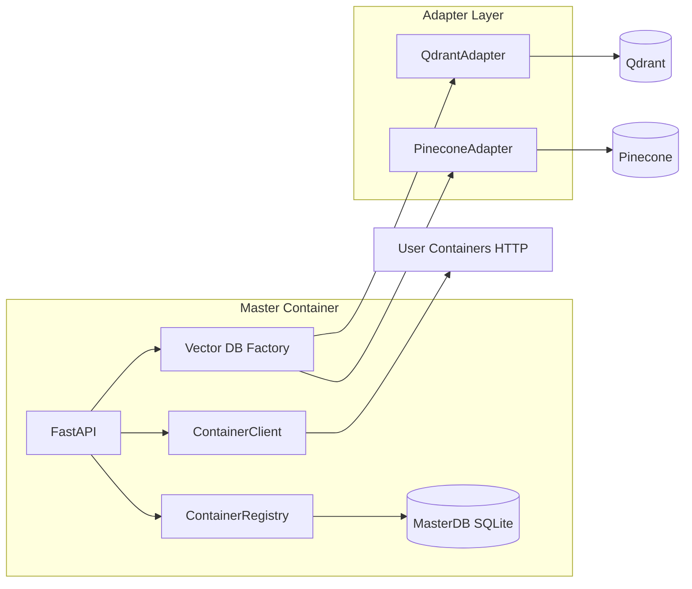

# Mnemo Master Container — Uygulama Planı

## Bağlam

[mnemo_master](/Users/sstprk/Desktop/mnemo/Project/mnemo_master) dizini şu an boş; mevcut rag-wiki kodu yok (SQLiteStateStore referansı yok). Depo kökü `mnemo-master/` yapısına uygun şekilde doldurulacak; kullanıcı isteğindeki dizin ağacı birebir uygulanacak.

## Mimari Özet

- Uygulama katmanı **hiçbir yerde** Qdrant/Pinecone istemcisini doğrudan import etmez; yalnızca [`app/vectordb/base.py`](app/vectordb/base.py) üzerinden `VectorDBAdapter` kullanır.
- `lifespan` içinde vektör DB başlatma **try/except** ile sarılır; hata durumunda `app.state.vectordb = None`, log uyarısı; API ayakta kalır. [`app/api/vectordb_routes.py`](app/api/vectordb_routes.py) içinde `get_vectordb` veya her route başında `None` kontrolü → **503** + anlaşılır mesaj.
- Paralel konteyner çağrıları: `asyncio.gather(..., return_exceptions=True)`; istisnalar `_unreachable` / `ContainerStatus` ile normalize edilir.

## 1. Proje iskeleti ve bağımlılıklar

- Kök: [`Dockerfile`](Dockerfile), [`docker-compose.yml`](docker-compose.yml), [`docker-compose.prod.yml`](docker-compose.prod.yml), [`.env.example`](.env.example), [`.gitignore`](.gitignore), [`README.md`](README.md), [`requirements.txt`](requirements.txt) — sürümler spesifikasyondaki gibi.
- **Port/env**: FINAL RULES “hardcoded port yok” ile uyum için Dockerfile’da `CMD` yerine `ENV APP_PORT=9000` + `sh -c 'uvicorn app.main:app --host 0.0.0.0 --port ${APP_PORT:-9000}'` (veya küçük bir entrypoint) tercih edilir; compose içinde `APP_PORT` ile override edilebilir.

## 2. Konfigürasyon — [`app/config.py`](app/config.py)

- `pydantic_settings.BaseSettings` ile tüm alanlar; `model_config` içinde `env_file`, `env_file_encoding`.
- Ortam değişken isimleri Pydantic v2 varsayılanıyla uyumlu (`VECTORDB_BACKEND`, `QDRANT_URL`, …); gerekirse `Field(validation_alias=...)` ile `.env.example` ile birebir eşleme doğrulanır.
- `qdrant_collection` / `qdrant_vector_size`: API’de zorunlu olmayan “varsayılan koleksiyon” bilgisi olarak kalabilir veya README’de dokümante edilir (otomatik `create_collection` istenmediyse startup’ta kullanılmaz).

## 3. Master SQLite — [`app/database.py`](app/database.py)

- **SQLAlchemy 2.0 Core** only: `create_engine`, `MetaData`, `Table`, `Column`, `insert`/`select`/`update`/`delete`.
- URL varsayılan `sqlite:///./data/master.db`; `MasterDB.__init__` içinde `data/` yoksa `os.makedirs(..., exist_ok=True)` (path’i URL’den türet: `sqlite:///` sonrası dosya yolu).
- Tablolar: `container_registry`, `health_check_log` — spesifikasyondaki şema.
- Metodlar: `get_container`, `list_containers`, `add_container` (duplicate → `ValueError`), `update_container` / `remove_container` (yok → `KeyError`), `enable`/`disable`, `log_health_check`, `get_health_history`.
- `_row_to_record` / `_record_to_dict`: `metadata_json` JSON parse/stringify; datetime alanları UTC veya naive `datetime.now()` — tutarlı tek seçim (tercihen UTC) ve API’de ISO string.

## 4. Registry — [`app/registry/models.py`](app/registry/models.py), [`app/registry/registry.py`](app/registry/registry.py)

- Dataclass’lar spesifikasyona uygun; `ContainerRegistry` ince sarmalayıcı, tüm I/O `MasterDB`’ye delege.

## 5. Vektör DB katmanı

### [`app/vectordb/base.py`](app/vectordb/base.py)

- `VectorDBError(message, backend, detail="")` ve `VectorDBAdapter` ABC — metod imzaları verilen sözleşmeyle aynı; `health` asla raise etmez.

### [`app/vectordb/filters.py`](app/vectordb/filters.py)

- Normalize format: `{"must": [{"field": "...", "value": ...}, ...]}`.
- `build_qdrant_filter` → `qdrant_client.models.Filter` (FieldCondition, MatchValue).
- `build_pinecone_filter` → metadata filter dict (`$eq` ile alanlar); boş/`None` → `None`.

### [`app/vectordb/qdrant_adapter.py`](app/vectordb/qdrant_adapter.py)

- `AsyncQdrantClient(url, api_key=... or None, timeout=...)`.
- Tüm Qdrant çağrıları try/except → `VectorDBError` (backend=`qdrant`).
- `delete_by_doc_id`: scroll ile `doc_id` eşleşen id’ler → batch 100 sil.
- `scroll`: Qdrant `scroll` offset’i doğrudan desteklemediği için **sayfa offset’i** uygulama içinde uygulanır: önceki sayfalar için iç scroll cursor ile ilerleyip `offset` kadar kayıt atlanır, sonra `limit` döndürülür (büyük offset’te maliyetli ama sözleşmeye uygun). Alternatif olarak dokümante edilmiş sınır eklenebilir.

### [`app/vectordb/pinecone_adapter.py`](app/vectordb/pinecone_adapter.py)

- **Pinecone Python SDK v3** ([`pinecone-client==3.2.2`](requirements.txt)): `Pinecone(api_key=...)`, index adı `settings.pinecone_index_name` veya metot parametresi `collection_name` ile; namespace varsayılan.
- `list_collections` → `list_indexes()` isimleri.
- `create_collection` → `create_index` + mesafe eşlemesi (Cosine/Euclidean).
- `get_collection_info` → `describe_index_stats` alanlarının normalize map’i.
- `upsert` / `search`: metadata = payload; skor/id normalize.
- `delete_by_doc_id` / `get_by_doc_id`: metadata filter (`doc_id`); query + düşük top_k veya uygun fetch stratejisi.
- `scroll`: Pinecone’da native yok → **`VectorDBError`** ile açık mesaj (sessiz başarısızlık yok).
- `count`: `describe_index_stats`; filtre desteği yoksa adapter içi yorum + filtre verilmişse davranış (ör. filtre varsa raise veya “tüm index” döndür — tercih: **filtre ile count desteklenmiyor** mesajı veya sadece filtre yokken total) — spesifikasyona uygun şekilde yorum satırı + tutarlı API (ör. filtre `None` değilse `VectorDBError` veya best-effort dokümantasyon).

### [`app/vectordb/factory.py`](app/vectordb/factory.py)

- Global singleton `_adapter_instance`; `get_vector_db_adapter(settings)` — bilinmeyen backend → `ValueError`.

## 6. HTTP istemcisi — [`app/clients/container_client.py`](app/clients/container_client.py)

- `httpx.AsyncClient`; `health_check` kısa timeout; `_headers` ile `X-Container-Key`.
- `_unreachable` standart dict.
- `health_check_all` / `get_stats_all`: `gather` + `return_exceptions`; exception → unreachable tuple/dict.

## 7. API — [`app/api/deps.py`](app/api/deps.py), route dosyaları

- `require_admin`: `ADMIN_API_KEY` boşsa tüm isteklere izin (dev); doluysa `X-Admin-Key` zorunlu ve eşleşme — **403**.
- `get_vectordb` / `get_registry` / `get_client`: `Request.app.state`.

### [`app/api/vectordb_routes.py`](app/api/vectordb_routes.py)

- Prefix `/master/vectordb`, tümü `Depends(require_admin)`.
- Query’den `source`/`department` → `{"must": [{"field":"source","value":...}, ...]}`.
- `GET .../docs/{doc_id}`: `get_by_doc_id`; boş → 404.
- Hata: `VectorDBError` → merkezi handler veya route’ta 503/404 ayrımı.

### [`app/api/registry_routes.py`](app/api/registry_routes.py)

- CRUD + enable/disable + `health-check` (anında ping, `MasterDB.log_health_check`) + `health-history`.

### [`app/api/aggregate_routes.py`](app/api/aggregate_routes.py)

- `GET /health` benzeri toplu sağlık: enabled konteynerler, log yazımı, `ContainerStatus` listesi (`stats` unreachable’da `None`).
- `GET /stats`: `get_stats_all`; totals sadece reachable ve beklenen şekilde parse edilebilen yanıtlardan; beklenmeyen şekil → `reachable=True`, `stats=null` (spesifikasyon).
- `GET /docs`: birleşik liste + her dokümana `container_id`.
- Flag/unflag/delete proxy; **DELETE tam silme**: (1) konteyner DELETE (2) `delete_by_doc_id` — bağımsız try/ blokları, her iki sonuç alanı dolu; hata mesajları kullanıcıya güvenli string (stack yok).

## 8. [`app/main.py`](app/main.py)

- `lifespan`: sıra — `MasterDB` → vektör adapter (try) → `ContainerRegistry` → `ContainerClient`.
- Router’ları include et.
- `GET /health` (auth yok): `vectordb` None veya `await adapter.health()` ile `vectordb_status`.
- Exception handlers: genel 500 (log `exc_info=True`, detay sabit); `VectorDBError` → mesajda "not found" → 404, diğer → 503.
- Her modülde `logger = logging.getLogger(__name__)`, mesajlarda `key=value` stili.

## 9. Docker

### [`docker-compose.yml`](docker-compose.yml)

- `qdrant` + `master` build; `./data:/app/data`; **`networks.mnemo-net.name: mnemo-net`** (köprü); volume `qdrant_data`.
- Kullanıcı konteynerlerinin aynı ağa bağlanması README’de anlatılır (aynı isimli network: compose ile oluşturulduğunda `docker network inspect mnemo-net` ile doğrulama; harici proje için `external: true` örneği).

### [`docker-compose.prod.yml`](docker-compose.prod.yml)

- `extends` veya `include` + override: tüm servislerde `restart: always`; **qdrant port mapping kaldırılır** (yalnızca internal); master + caddy; **logging**: `json-file`, `max-size: 10m`, `max-file: 3`.
- **Caddy**: örnek `Caddyfile` (repo kökünde) veya inline command — HTTPS 443 → `master:9000`; TLS için self-signed veya kullanıcı alan adı placeholder (README’de Let’s Encrypt notu).

## 10. README ve .env.example

- İstenen bölümler (building block, quick start, backend değişimi, env tablosu, API tablosu, konteyner sözleşmesi `/health`, `/stats`, `/docs`, ağ, yeni backend adımları).
- API tablosu tüm master prefix’leriyle.

## 11. Kalite ve doğrulama (uygulama aşamasında)

- Yerel: `docker compose up --build`, `curl http://localhost:9000/health`, OpenAPI `/docs` gözden geçirme.
- İsteğe bağlı: minimal `pytest` ile `require_admin` ve `_unreachable` davranışı (zorunlu tutulmayabilir; kullanıcı istemedi).

## Risk / Netleştirme Notları

| Konu | Karar |
|------|--------|
| Boş repo | Tüm dosyalar sıfırdan oluşturulacak. |
| Pinecone `scroll` | `VectorDBError` ile açık “desteklenmiyor”. |
| Qdrant `scroll` + `offset` | İç cursor ile offset simülasyonu veya dokümante sınır. |
| Dockerfile port | `APP_PORT` env ile uvicorn portu. |
| `qdrant_collection` | Startup’ta zorunlu kullanım yok; env/README ile tutarlılık. |
